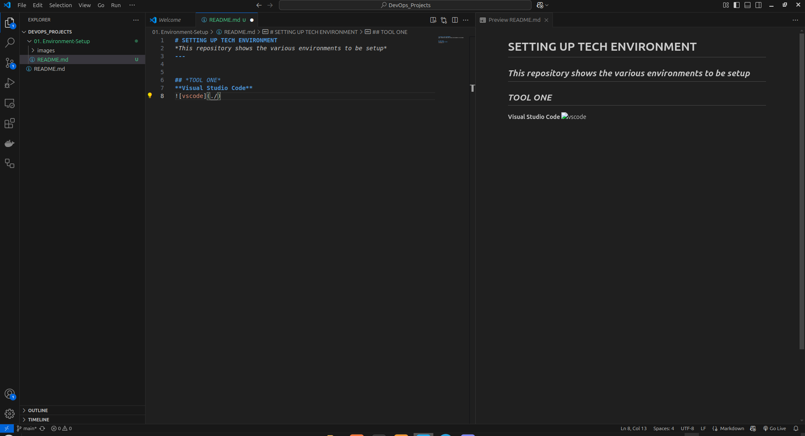
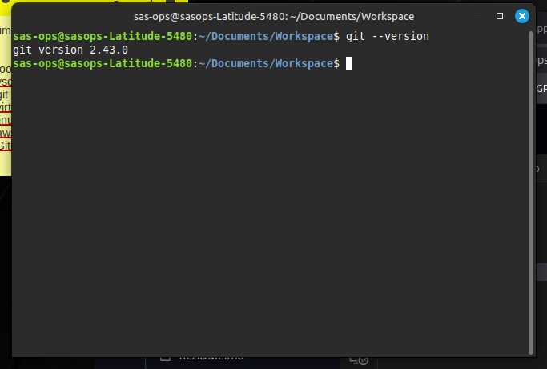
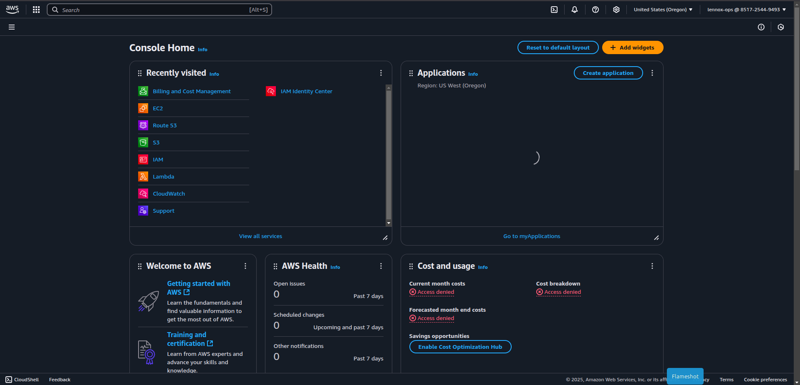
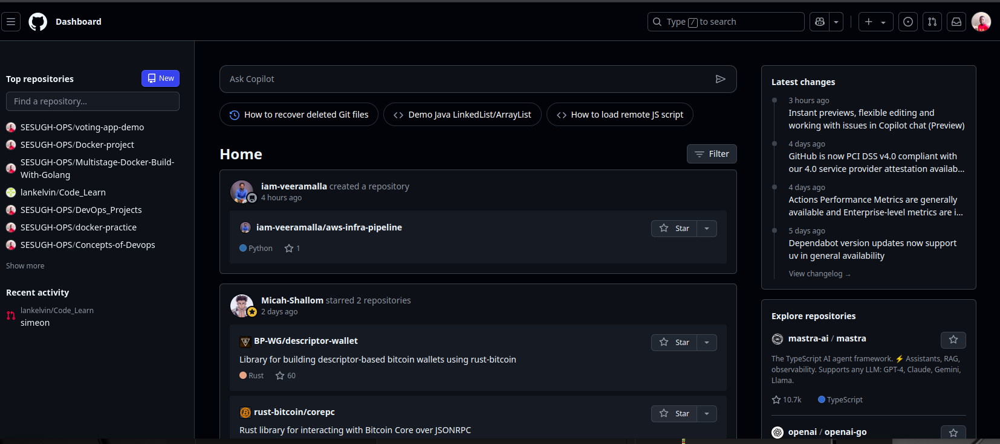

# SETTING UP TECH ENVIRONMENT
*This repository shows the various environments to be setup*

---
 

## *TOOL ONE*
**Visual Studio Code**
---

 
 

## *TOOL TWO*
**GIT**
---

 
 
 

## *TOOL THREE*
**Linux Environment**
---

 
 
 

## *TOOL FOUR*
**AWS account**
---

 
 
 

## TOOL FIVE
**Github Account**
---

