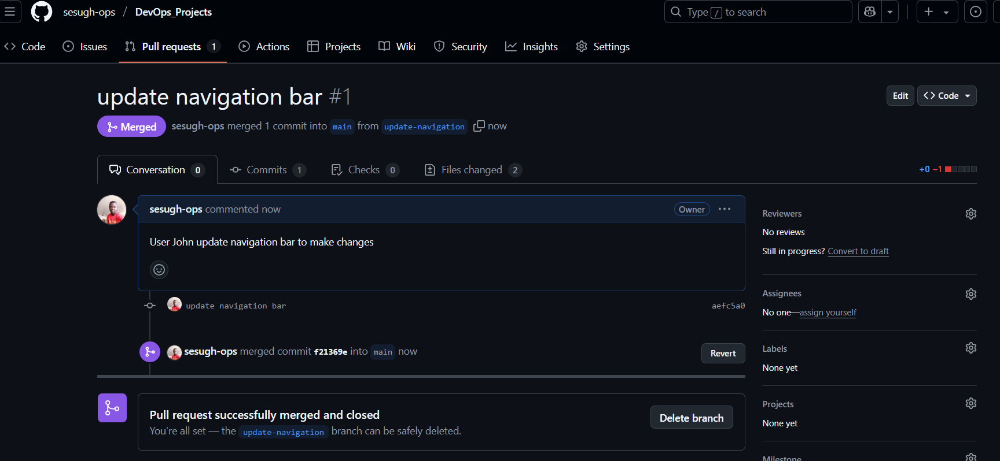
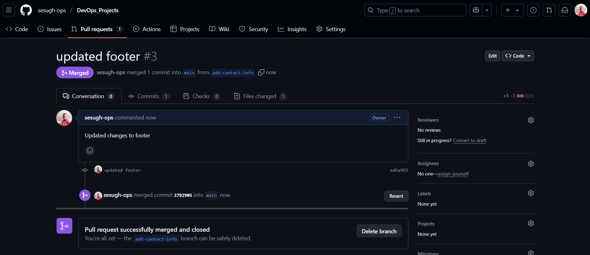

# GIT INITIAL SETUP
*This project shows the initial setup of how git collaboration works*

---
 

## HOW THE WEBSITE LOOKS

## WORKFLOW OF THE COLLABORATION
*Two users TOM and JERRY working simultaeneoulsy with two different branches*

## STEP ONE
*Users Tom and Jerry created branches as shown below*
---

 

## STEP TWO 
*User John made changes to navigation bar and made a pull request which got approved and merged*

*The new changes to the website on the navigation bar*

 

## STEP THREE
*User Jerry made changes to the footer and made a pull request which got apporved*

*The new changes to the footer on the webpage*

