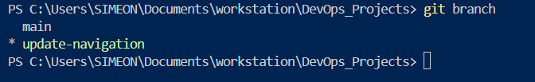
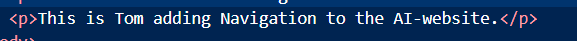
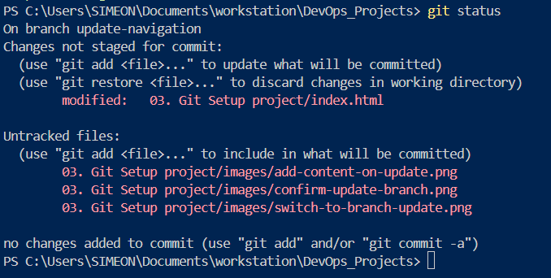
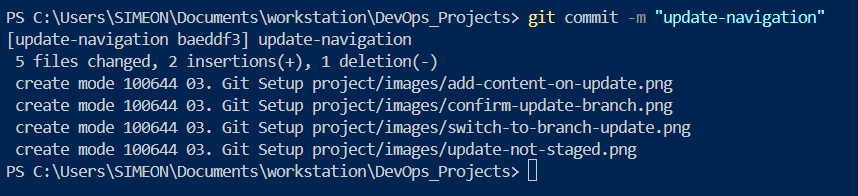

# **GIT COLLABORATION ON AI-STARTUP-WEBISTE**

## Part one - setup and initial configuration

1. Created and index.html file for Tom and Jerry

2. Checked for if changes were not staged on git

3. Staged changes

4. Changes were committed

5. Commited changes pushed to github main branch

---

## Part 2 - Simulating Toms work

1. Checking if branch is only main

2. Creating a branch for Toms work

3. Confrim creation of branch for Tom

4. Add content to index.html on Toms branch

5. Check for unstaged changes on Toms branch

6. Stage changes on Tom branch

7. Push Toms branch with staged changes to remote

