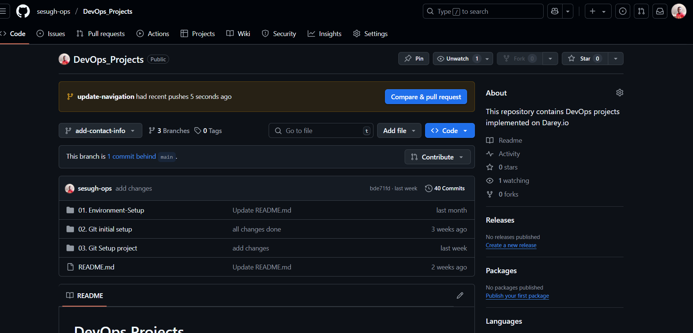
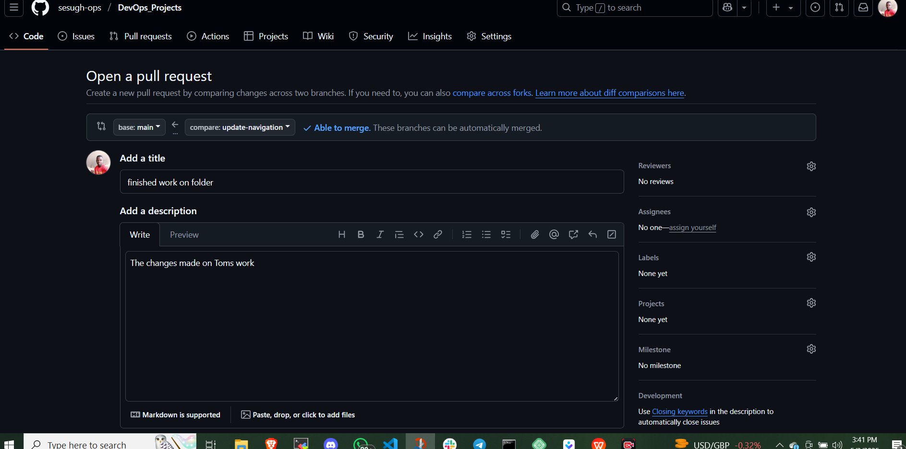
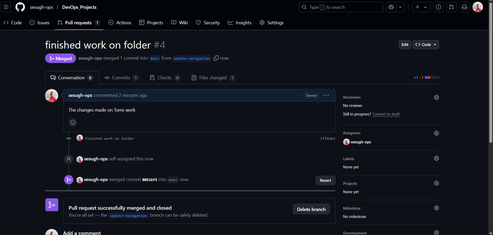
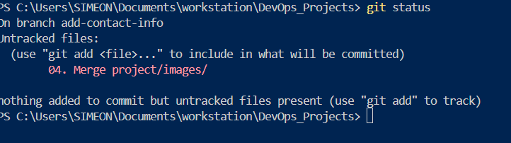
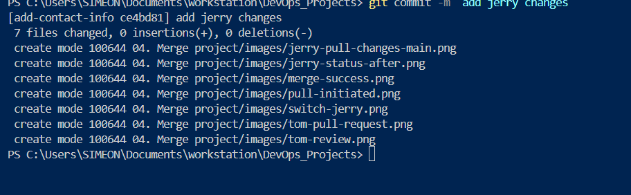
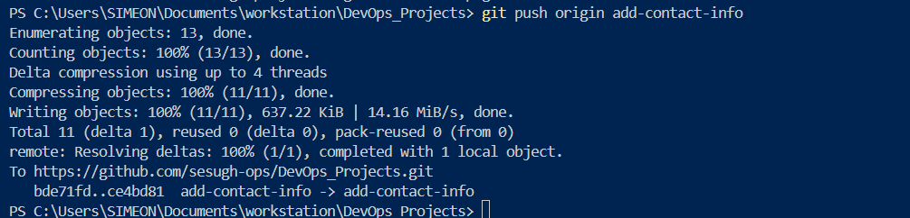
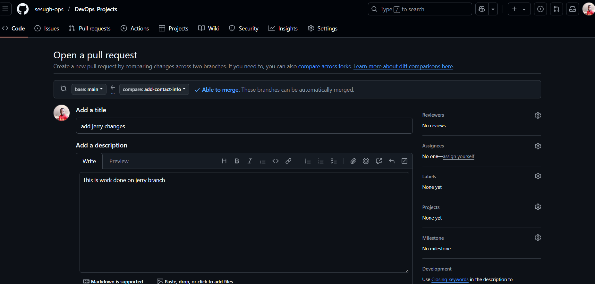
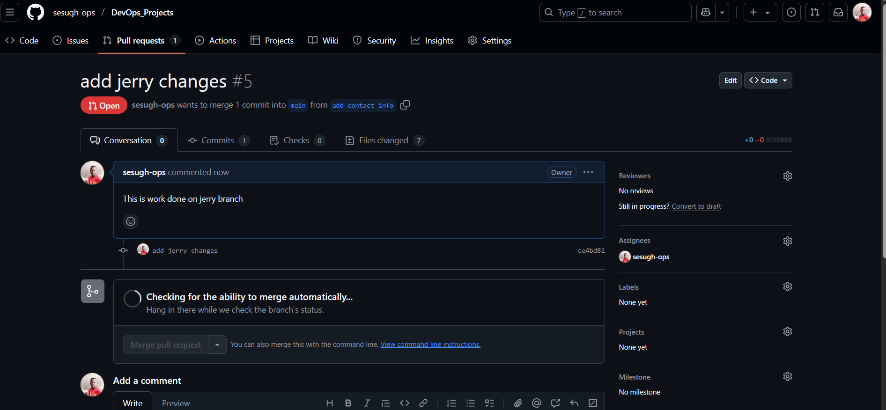

# **TOM AND JERRY PULL REQUEST AND MERGING**

## part one - Tom pull request and merging simulation

1. Navigated to Github repository and created a pull request for Tom

2. Pull requested initiated for Toms branch

3. Pull Request merged for Tom

---

## part two - Jerry pull request and simulation

1. Switched to Jerry branch

2. Pull changes from main branch

3. Jerry status after pulling main branch changes

4. Add jerry changes

5. Commit jerry changes

6. Push jerry changes to jerry origin

7. Review jerry changes for pull request

8. Create pull request for jerry

9. Merge jerry pull request

