# **GREENWOOD COMMUNITY LIBRARY**

*This website entails about enhancing a community library website workflow and a collaboration between two developers Morgan and jamie*

## part one - creating various pages for the main branch

1. Created various pages and added content

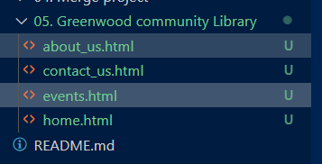

2. This are the various page and the visual representation of their code content

2. Stage files for commiting

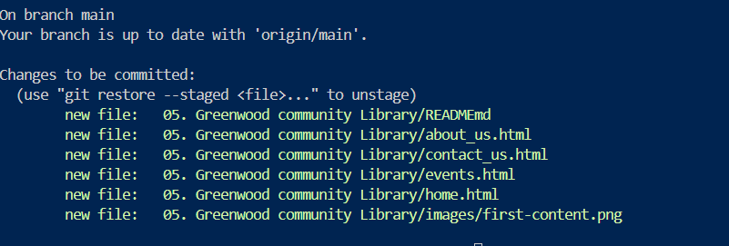

3. Commit files for pushing

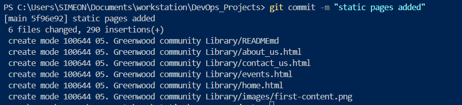

4. Push files to main repository

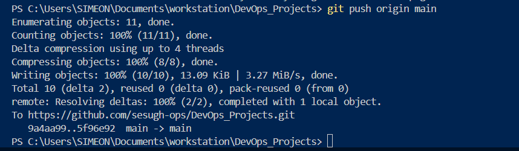

## part two - Morgans work review

1. Created a branch for Morgan and switched to the branch

2. Created a file for Morgan branch called book review

3. Added content to the new file

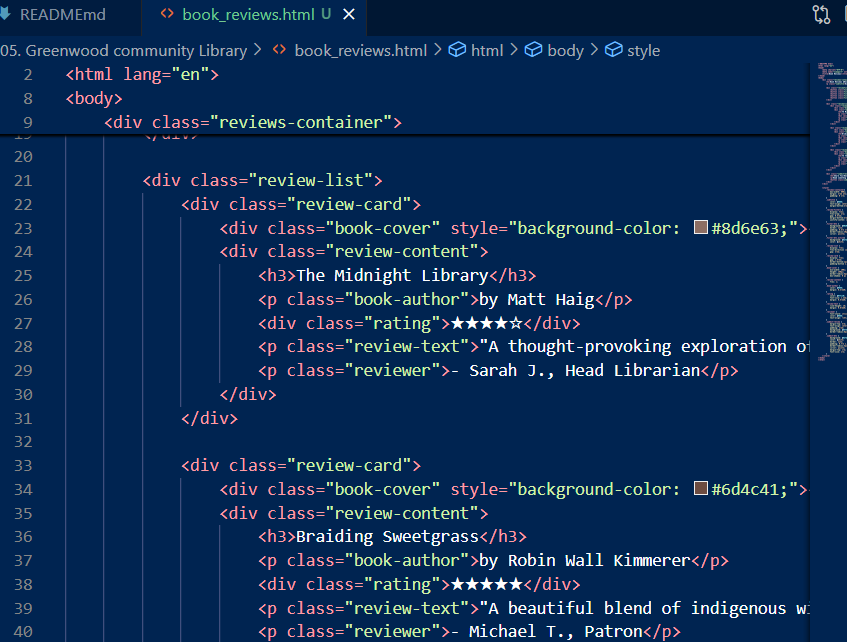

4. stage Files

5. Commit changes 

6. Push branch to repository

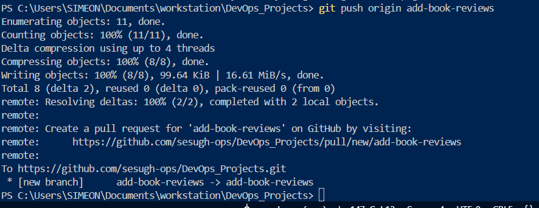

7. Create Pull request for Morgan branch

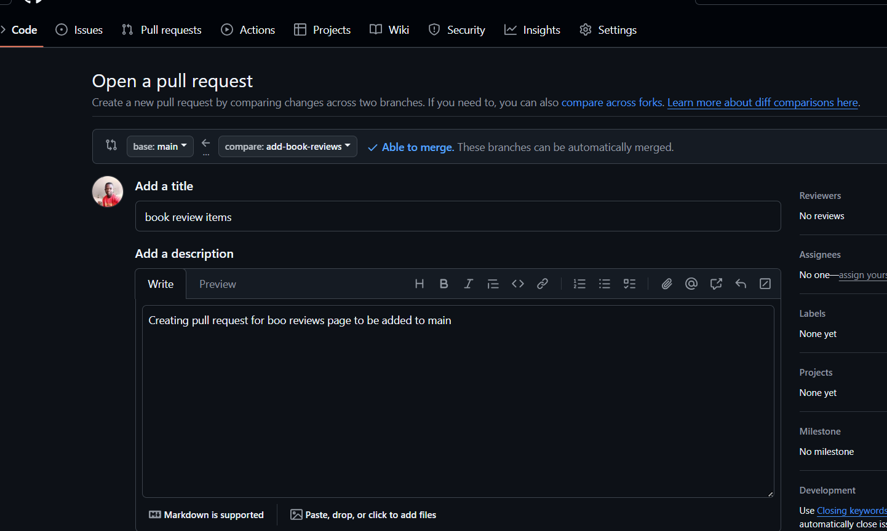

8. Merge branch to main

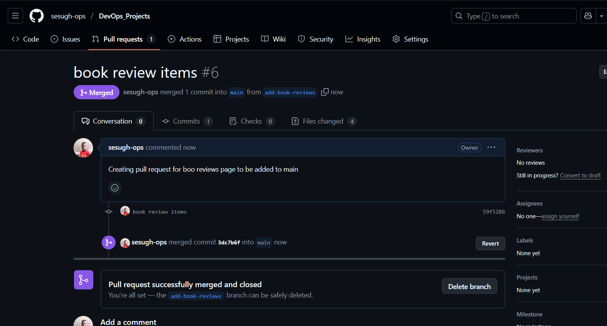

## part three - Jamie's work review

1. Created a branch for jamie and switched to the branch

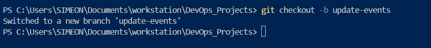

2. Created a file for the branch called update events

3. Added files to the new file

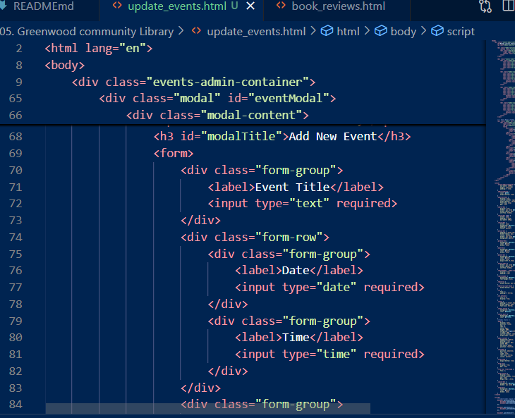

4. Stage files to commit 

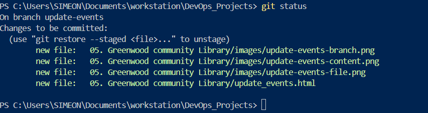

5. Commit files to branch

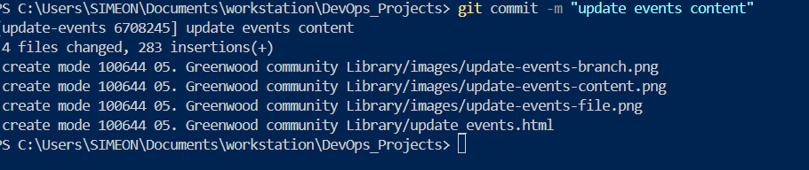

6. Push branch with files to remote

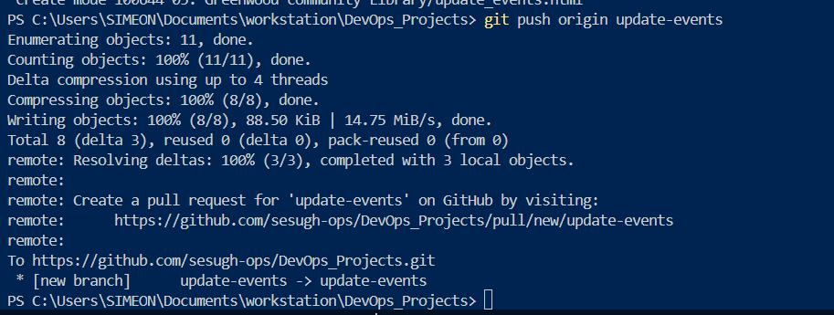

7. Create a pull request 

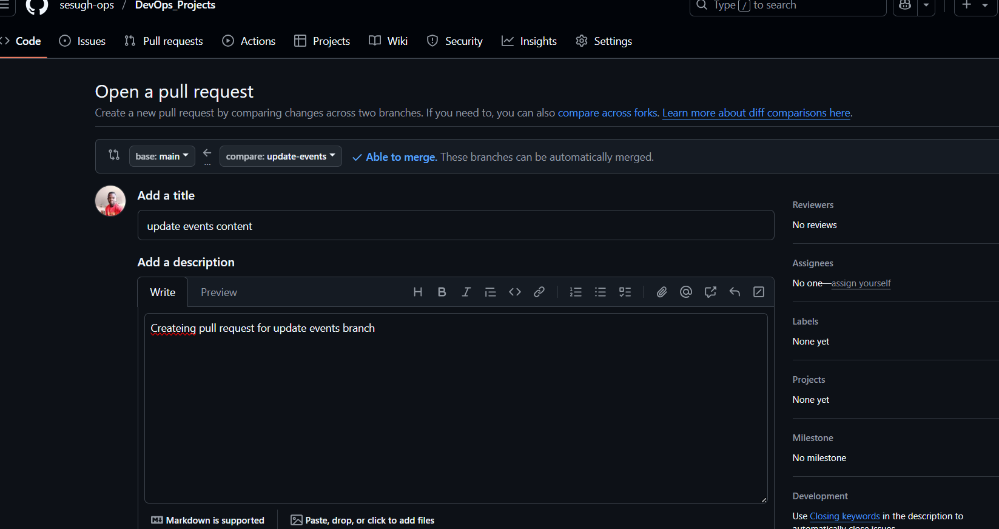

8. Merge files to main

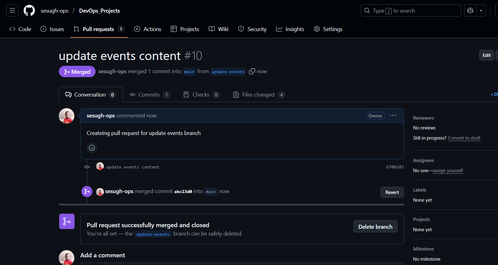

