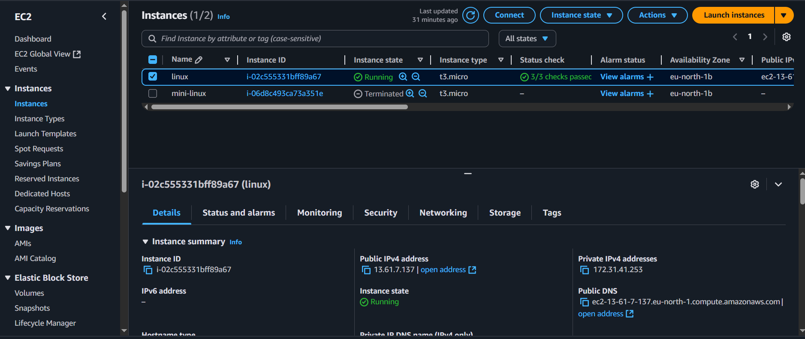
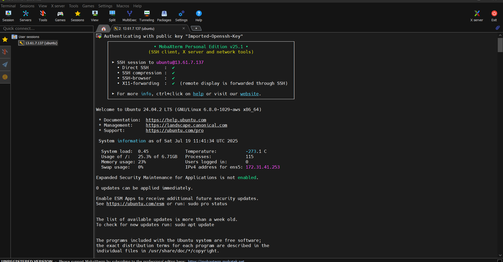
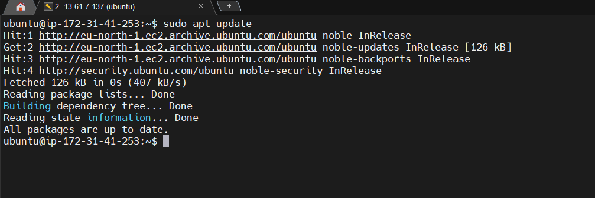
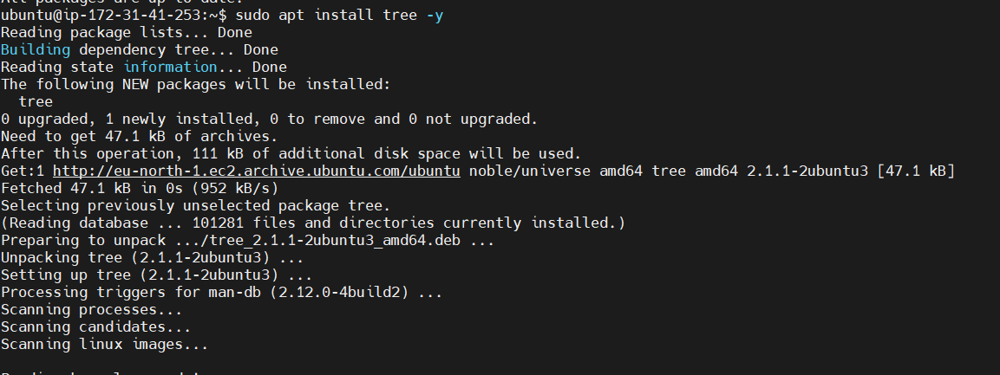
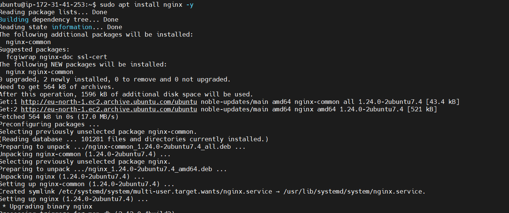
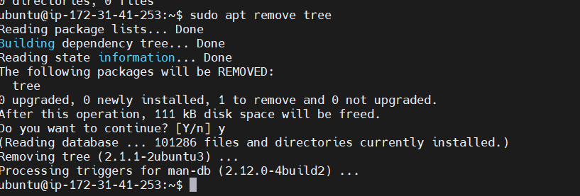
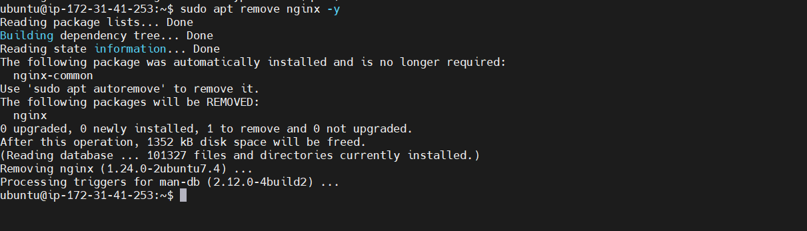
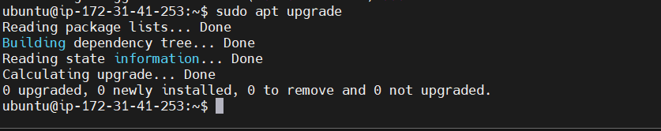

# **LINUX MINI PROJECT FUNDAMENTALS**

*This project shows the various steps on how to spin up a virtual server and perform fundamental liux tasks*

---

## STEP ONE
* Create a virtual server i.e EC2 instance

## STEP TWO 
* Connect to the EC2 instance using mobaxterm

## STEP THREE

* Update packages on server

## STEP FOUR

* How to install packages on Ubuntu server 

 Installing tree and nginx packages

## STEP FIVE

* How to remove packages on Ubuntu server

Removing Nginx and tree packages

## STEP SIX

* How to upgrade packages

