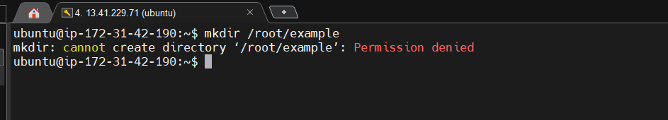
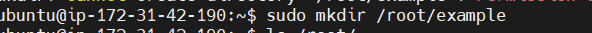
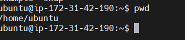

# *MINI PROJECT - BASIC LINUX COMMANDS*

*This project entails about the basic linux commands that can be done on a linux machine, be it virtual servers or physical linux machines*

---

## INTRODUCTION

* What is a linux command?

  A Linux command is a text-based instruction given to the Linux operating system to perform specific tasks.

## STEPS TO MAKIKNG USE OF LINUX COMMANDS

1. Manipulating Files and Directories on Linux
  
   Directories are like folders on a linux machine and they can be manipulated using the higher privelege command called `sudo`.

   Why use sudo?
    
      It helps in keeping the system secure by limiting access to powerful commands.

2.  How sudo works?
    
    - Creating a Folder with sudo
       
       Sometimes you need superuser(sudo) privileges to create folders in certain locations.

       let us take a use case and try creating a folder without sudo in the /root directory.

       

       permission was denied from the above command in the virtual server.


       - Now let us create the folder with sudo

       

       

       The above command creates and we show the example folder by listing it.

3. PWD - command

    The `pwd` command is used to find the path of your current working directory.

    The `pwd` command uses the following syntax.
    
    ```
    pwd /users/dareyio/Desktop 
    ```
   
   
   This shows how the pwd command works.


4. The `CD` command
    
      The `cd` command is used to to navigate through directories and files.

      - lets navigate to the root directory using the `cd` command.

      ```
      cd /
      ```

      

      The above command takes you the root directory indicated as `/`.


      - Let us confirm if we are in the root directory
      
      indicating we are in the root directory because of `/`.

      - Let us show all files in the root directory using `ls`.
      

This project show us the basic linux commands we use.

Note - THis are not all the commands but just to show a use case of many of them.


          
